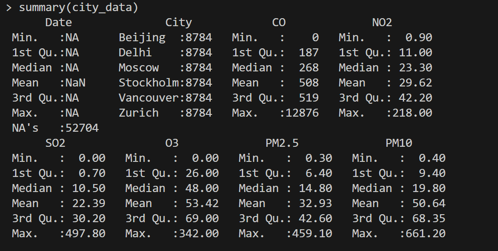
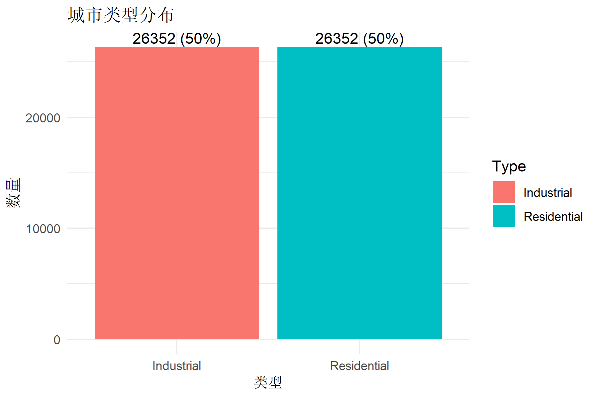
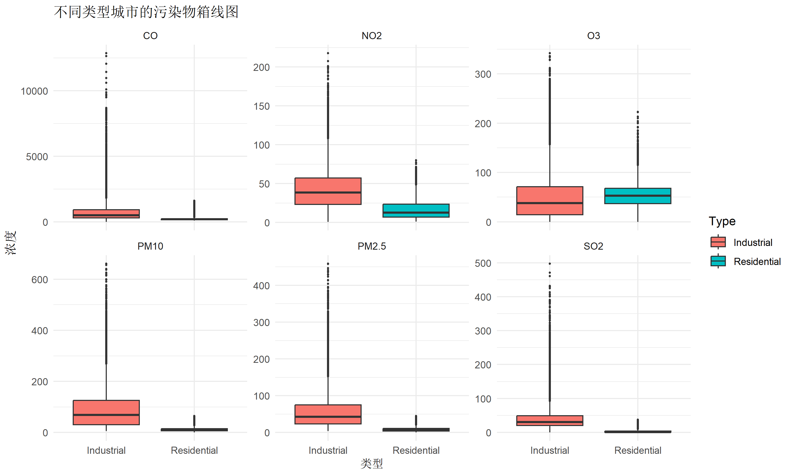
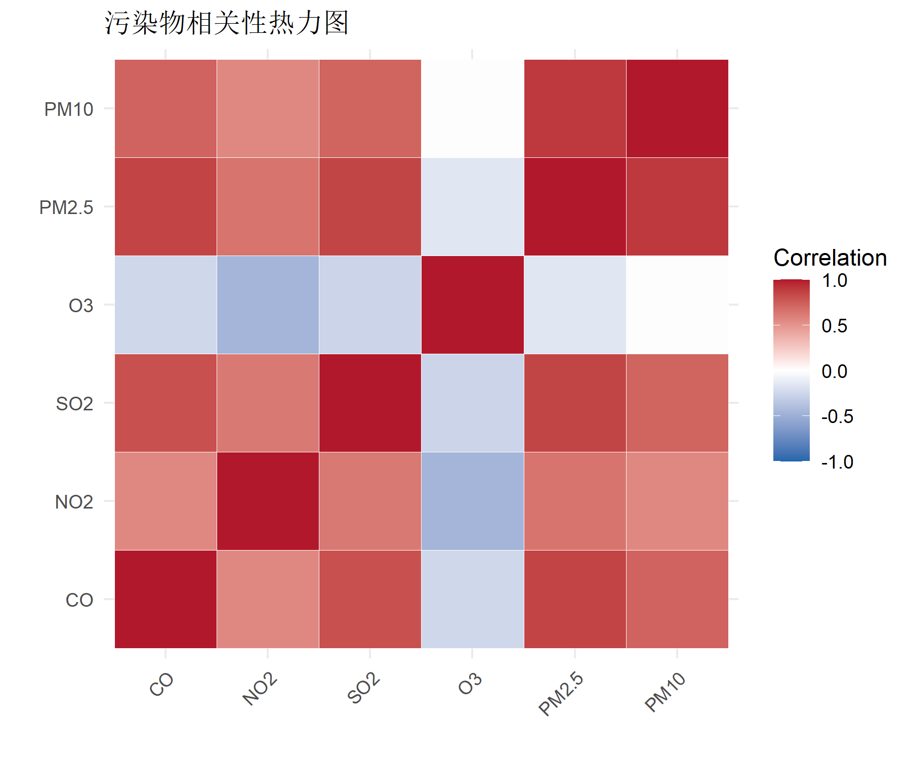
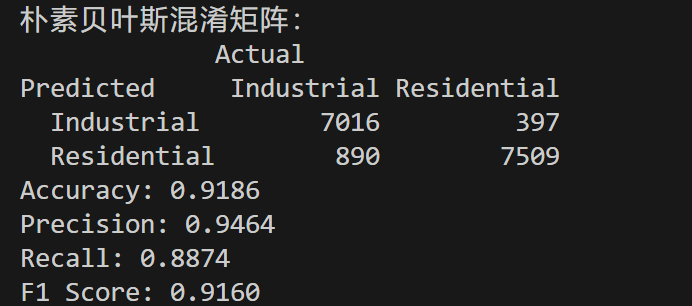
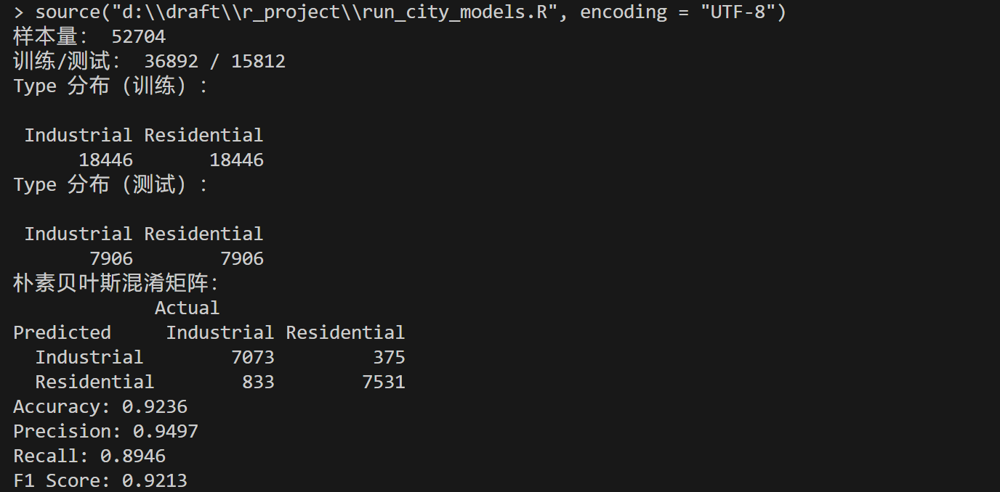
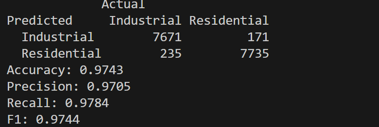
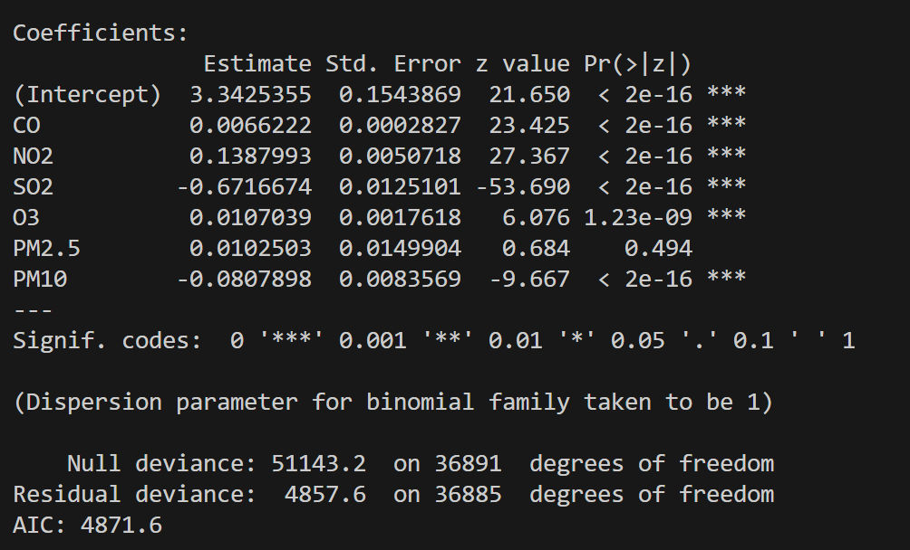
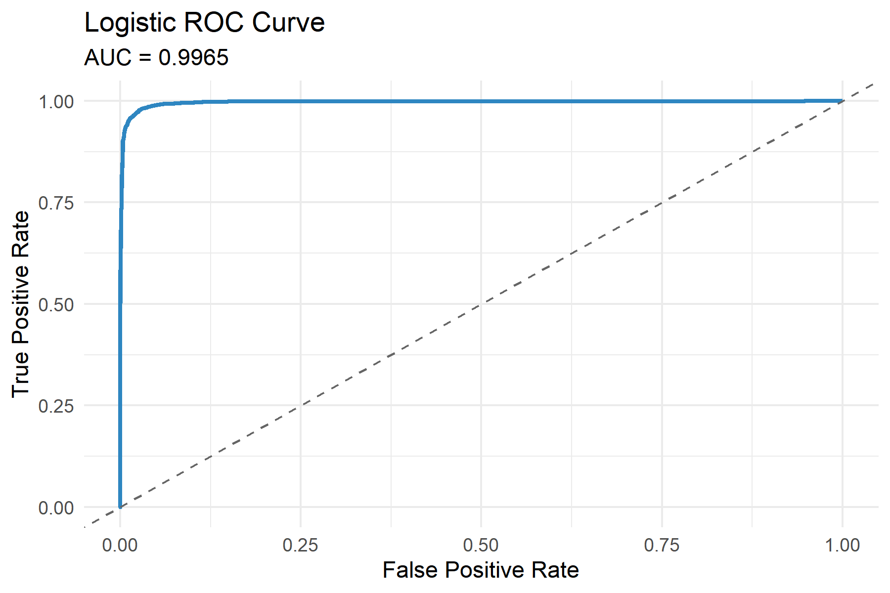

# 基于空气质量特征的城市功能区识别分析报告


## 1. 项目背景与研究目标

### 1.1 研究背景

#### 1.1.1 城市化与空气质量挑战

随着全球城市化进程的不断加速,城市功能区的空间形态与人类活动类型日益复杂多样。根据联合国统计,全球超过55%的人口居住在城市地区,预计到2050年这一比例将达到68%。快速城市化带来了前所未有的环境挑战,其中大气污染问题尤为突出。

不同城市功能区由于其独特的经济活动、交通模式和能源消耗结构,产生了差异化的污染排放特征。这种差异性为我们通过空气质量数据识别和分类城市功能区提供了科学依据。

#### 1.1.2 功能区污染物"指纹"特征

城市功能区按其主要用途可分为工业区、居住区、商业区、交通枢纽等类型。本研究聚焦于工业区与居住区的二分类问题,这两类功能区在污染排放源结构上存在显著差异:

* **工业区污染特征**:
  * **主要排放源**: 燃煤锅炉、重化工生产、工业窑炉、建筑扬尘、货运交通
  * **典型污染物**: SO₂(二氧化硫)、颗粒物(PM10/PM2.5)、CO(一氧化碳)浓度显著偏高
  * **时间模式**: 工作日污染水平高于周末,呈现明显的生产周期规律
  * **背后机制**: 燃煤过程释放大量SO₂,工业粉尘和机械作业产生粗颗粒物(PM10),不完全燃烧导致CO积累

* **居住区污染特征**:
  * **主要排放源**: 机动车尾气、民用燃气、餐饮油烟、小型供暖设施
  * **典型污染物**: NO₂/NOx(氮氧化物)占比更高,反映交通排放的主导地位
  * **时间模式**: 早晚交通高峰期污染浓度明显上升
  * **背后机制**: 汽车发动机高温燃烧产生氮氧化物,光化学反应形成O₃(臭氧)

这种污染物组成的差异性形成了不同功能区独特的"化学指纹",为基于机器学习的自动识别提供了理论基础。

#### 1.1.3 研究意义与应用场景

准确识别城市功能区的污染特征具有重要的理论价值和实践意义:

1. **环境监管优化**: 快速识别功能区与实际污染特征不匹配的异常点位
2. **污染源溯源**: 为突发污染事件提供源头识别技术支持
3. **城市规划支撑**: 为功能区优化布局和污染防控提供数据依据

### 1.2 研究目标

本研究基于 `City_Types.csv` 空气质量监测数据集,采用监督学习方法构建分类模型,具体目标包括:

* **目标一**: 验证污染物浓度特征对城市功能区的区分能力
* **目标二**: 识别对功能区分类贡献最大的关键污染物指标
* **目标三**: 分析模型的可解释性,理解不同污染物的作用机制

最终目标是建立一个高准确率、强可解释性的自动分类系统,能够基于常规空气质量监测数据,自动识别监测点所属城市功能区类型:`Industrial`(工业区)或 `Residential`(居住区)。

### 1.3 分析价值

本研究的价值体现在以下几个方面:

* **特征有效性验证**: 
  * 系统评估空气质量数据对功能区类型的区分能力
  * 量化不同污染物指标的贡献度和显著性水平
  * 为未来类似研究提供方法学参考

* **归因分析与机制解释**:
  * 识别最关键的污染物指标并解释其方向性(正相关/负相关)
  * 揭示污染物组合特征与排放源结构的内在联系
  * 建立从化学特征到功能属性的推断逻辑链条

* **实践应用价值**:
  * **异常检测**: 对"标记为居住区但呈现工业型污染特征"的监测点位进行自动预警
  * **质量控制**: 识别数据标注错误或功能区用途变化的情况
  * **动态监控**: 追踪功能区随时间演化的污染特征变化趋势
  * **成本优化**: 以低成本、高效率的方式辅助传统实地调查方法

---

## 2. 数据处理与实验设计


### 2.1 数据加载与基础字段检查

#### 2.1.1 数据导入

首先加载原始数据集并进行初步检查。这里设置 `stringsAsFactors = FALSE` 以避免R自动将字符串转换为因子,保持数据处理的灵活性:

```r
city_data <- read.csv("City_Types.csv", stringsAsFactors = FALSE)

# 查看数据结构
str(city_data)

# 基础统计摘要
summary(city_data)
```


#### 2.1.2 数据集结构分析
通过summary观察到数据集的基本结构信息:

* **总样本量**: 52,704条独立观测记录
  * Industrial(工业区): 26,352条 (50.0%)
  * Residential(居住区): 26,352条 (50.0%)
  * 数据集完全平衡,无需类别权重调整

* **数据字段**(共8个变量):
  * `Date`: POSIXct时间戳格式,记录观测的精确时间(2024年1月完整月份数据)
  * `City`: 分类变量
  * `CO`、`NO2`、`SO2`、`O3`、`PM2.5`、`PM10`: 6个连续型数值变量,表示各污染物的小时浓度(单位:μg/m³或ppm)
  * `Type`: 二分类目标变量 — Industrial(工业区)、Residential(居住区)

* **数据质量评估**:
  * **类别平衡性**: Industrial和Residential样本量完全相等(各占50%),理想的平衡数据集
  * **时空覆盖**: 包含4个不同气候区城市,具备一定的地理代表性
  * **时间分辨率**: 小时级观测数据,可捕捉污染的短期波动特征
  * **缺失值情况**: 存在少量缺失值(后续将通过中位数填充处理)

---

### 2.2 类型转换与时间特征提取

```r
# 目标变量转因子（分类建模标准做法）
city_data$Type <- factor(city_data$Type)

# City 仅用于审阅，不进入模型；这里转因子方便查看
city_data$City <- factor(city_data$City)

# 时间解析（统一到 UTC）
city_data$Date <- as.POSIXct(
  city_data$Date,
  format = "%Y-%m-%d %H:%M:%S%z",
  tz = "UTC"
)

lt <- as.POSIXlt(city_data$Date, tz = "UTC")

# 提取可选辅助时间特征
city_data$hour  <- lt$hour
city_data$month <- lt$mon + 1
```

---

### 2.3 缺失值处理(中位数填充)


大气污染物浓度数据通常呈现显著的**右偏分布**(positive skewness),存在大量极端高值(污染峰值事件)。在这种分布特征下:

* **均值填充的缺陷**: 
  * 均值受极端值强烈影响,无法代表"典型"浓度水平
  * 可能引入虚假的高浓度值,扭曲数据分布
  
* **中位数填充的优势**:
  * 中位数是**稳健统计量**(robust statistic),对离群值不敏感
  * 更准确地反映数据的中心趋势
  * 保持原始分布的基本形态

```r
# 定义需要填充的数值型变量
num_vars <- c("CO","NO2","SO2","O3","PM2.5","PM10")

# 对每个变量使用中位数填充缺失值
for (col in num_vars) {
  # 计算该变量的中位数(排除NA值)
  med <- median(city_data[[col]], na.rm = TRUE)
  
  # 将缺失值替换为中位数
  city_data[[col]][is.na(city_data[[col]])] <- med
}
```


---

### 2.4 特征选择与数据划分

#### 2.4.1 特征选择 —— 控制混淆变量


1. **City 是混淆变量(Confounder)**:
   * 不同城市可能有不同的工业化程度、能源结构和经济发展水平
   * 如果保留`City`,模型可能学会"北京 → 工业区"这样的捷径,而非基于污染物特征的本质判断
   * 这会严重损害模型的泛化能力(无法应用于新城市)

2. **Date 包含时间信息**:
   * 虽然时间特征(小时/月份)可能包含有用信息,但本研究聚焦于污染物浓度的静态区分能力
   * 时间特征的加入会增加模型复杂度,可能掩盖污染物本身的贡献

**特征选择代码**:

```r
# 仅保留6个污染物浓度特征 + 目标变量
feature_cols <- c("CO","NO2","SO2","O3","PM2.5","PM10")
model_df <- city_data[, c(feature_cols, "Type")]
```

#### 2.4.2 训练集/测试集划分 —— 分层随机抽样

**划分策略**: 采用**分层随机抽样**(Stratified Random Sampling),按照 **70% 训练 / 30% 测试** 的比例分割数据。

**实现代码**:

```r
set.seed(123)

idx_ind <- which(model_df$Type == "Industrial")
idx_res <- which(model_df$Type == "Residential")
idx_ind <- sample(idx_ind)
idx_res <- sample(idx_res)
cut_ind <- floor(0.7 * length(idx_ind))
cut_res <- floor(0.7 * length(idx_res))
# 合并两类样本的训练集和测试集索引
train_idx <- c(idx_ind[1:cut_ind], idx_res[1:cut_res])
test_idx  <- c(idx_ind[(cut_ind+1):length(idx_ind)],
               idx_res[(cut_res+1):length(idx_res)])

# 生成最终的训练数据和测试数据
train_data <- model_df[train_idx, ]
test_data  <- model_df[test_idx, ]
               
```

---

## 3. 探索性数据分析（EDA）

### 3.0 可视化分析目标

在构建预测模型之前,探索性数据分析(Exploratory Data Analysis, EDA)是深入理解数据特性的关键步骤。通过系统的可视化分析,我们可以:

1. **验证数据质量**: 检查类别平衡性、识别异常值和数据分布特征
2. **探索组间差异**: 直观对比工业区与居住区在各污染物上的差异模式
3. **发现变量关系**: 揭示污染物之间的相关性结构和潜在的多重共线性问题

```r
library(ggplot2)  # 数据可视化核心包
library(dplyr)    # 数据处理与转换
library(tidyr)    # 数据格式转换(宽表 ←→ 长表)

# 创建图形输出目录
dir.create("figures", showWarnings = FALSE)
```

### 3.1 类别分布检查

#### 3.1.1 分析目的

验证数据集的类别平衡性,确认Industrial和Residential样本数量相等。**类别不平衡**是机器学习中的常见问题,会导致模型偏向多数类,影响分类性能的公正评估。

#### 3.1.2 可视化代码

```r
p_type <- ggplot(model_df, aes(x = Type, fill = Type)) +
  geom_bar(width = 0.7) +
  geom_text(stat = "count", aes(label = after_stat(count)), vjust = -0.4, size = 4) +
  scale_fill_manual(values = c("Industrial" = "#E74C3C", "Residential" = "#3498DB")) +
  theme_minimal() +
  theme(legend.position = "none",
        plot.title = element_text(hjust = 0.5, face = "bold"))

ggsave("figures/type_distribution.png", p_type, width = 6, height = 4, dpi = 200)
```



#### 3.1.3 关键发现

从上图可以清晰看出数据集的类别分布特征：

* **完美平衡的二分类数据集**:
  * Industrial(工业区): 26,352个样本 (50.00%)
  * Residential(居住区): 26,352个样本 (50.00%)
  * 样本比例为 1:1,完全平衡

**意义**: 平衡的数据集消除了类别偏倚,使得准确率(Accuracy)成为可靠的评估指标。无需进行过采样(Oversampling)、欠采样(Undersampling)或类别权重调整。

---

### 3.2 污染物分布特征

#### 3.2.1 分析目的

通过箱线图(Boxplot)直观比较工业区与居住区在6种污染物上的浓度分布差异。箱线图能够同时展示:
* **中心趋势**: 中位数(箱体中间线)
* **离散程度**: 四分位距IQR(箱体高度)
* **数据范围**: 须线(whiskers)覆盖的正常值范围
* **异常值**: 超出1.5×IQR范围的离群点

#### 3.2.2 可视化代码

```r
# 定义6种污染物
pollutants <- c("CO","NO2","SO2","O3","PM2.5","PM10")

long_df <- model_df %>%
  select(all_of(pollutants), Type) %>%
  pivot_longer(cols = all_of(pollutants),
               names_to = "Pollutant",
               values_to = "Value")

# 绘制分面箱线图
p_box <- ggplot(long_df, aes(x = Type, y = Value, fill = Type)) +
  geom_boxplot(outlier.alpha = 0.25, width = 0.7, outlier.size = 0.5) +
  facet_wrap(~ Pollutant, scales = "free_y", ncol = 3) +
  scale_fill_manual(values = c("Industrial" = "#E74C3C", "Residential" = "#3498DB")) +
  theme_minimal() +
  theme(legend.position = "bottom",
        plot.title = element_text(hjust = 0.5, face = "bold"),
        strip.text = element_text(face = "bold"))

ggsave("figures/pollutant_boxplots.png", p_box, width = 10, height = 6, dpi = 200)
```



#### 3.2.3 详细发现与环境科学解释

**1. SO₂和PM10: 工业区的强信号**
* **观察**: 工业区的SO₂和PM10中位数显著高于居住区,箱体几乎无重叠
* **机制**: 
  * SO₂主要来自燃煤锅炉和工业窑炉中硫的氧化
  * PM10(粗颗粒物)源于工业粉尘、建筑扬尘、矿物加工等机械过程
* **区分能力**: 这两个指标是识别工业区的最强特征

**2. CO: 浓度差异显著**

* **观察**: 工业区CO分布整体右移,上四分位数约为居住区的2倍
* **机制**: 不完全燃烧产生CO,工业区的重型设备、燃煤过程和货运交通导致CO排放量大
* **统计特征**:位置差异明显

**3. NO₂: 工业区略高但重叠大**

* **观察**: 两类箱体大量重叠
* **机制**: NO₂主要来自机动车高温燃烧,居住区交通密度高导致NO₂累积
* **局限性**: 单独使用NO₂很难区分两类功能区,需结合其他污染物

**4. O₃: 有趣的反向关系**

* **观察**: 居住区O₃中位数浓度高于工业区
* **机制**: 
  * O₃由NOx和VOCs在阳光下光化学反应生成
  * 工业区NOx浓度过高时,反而会通过NO+O₃→NO₂反应消耗O₃(NOx滴定效应)
  * 居住区NOx适中,有利于O₃积累
* **应用**: O₃可作为居住区的辅助标志物

**5. PM2.5和PM10: 高度相关的颗粒物**
* **观察**: 两者分布模式相似,工业区明显更高
* **共线性**: 后续建模需注意这两个变量的多重共线性问题

**6. 异常值的普遍性**

* **观察**: 所有污染物都存在大量离群点(outliers)
* **原因**: 
  * 短期排放高峰(如交通拥堵、工业生产高峰)
* **处理**: 本研究保留异常值,因为它们反映了真实的环境波动

---

### 3.3 相关性分析

#### 3.3.1 分析目的
揭示污染物之间的线性相关性结构,识别潜在的多重共线性问题。**多重共线性**会导致:
* **朴素贝叶斯**: 违反"特征独立性"假设,夸大某些特征的贡献
* **逻辑回归**: 系数方差膨胀,参数估计不稳定,显著性检验失效

#### 3.3.2 可视化代码

```r
# 计算相关系数矩阵
cor_mat <- cor(model_df[, pollutants], use = "pairwise.complete.obs")

# 转换为长表格式(便于ggplot2绘图)
cor_df <- as.data.frame(as.table(cor_mat))
names(cor_df) <- c("Var1","Var2","Corr")

# 绘制相关性热力图
p_cor <- ggplot(cor_df, aes(x = Var1, y = Var2, fill = Corr)) +
  geom_tile(color = "white", size = 0.5) +
  geom_text(aes(label = sprintf("%.2f", Corr)), size = 3.5, fontface = "bold") +
  labs(title = "污染物相关性热力图", 
       x = NULL, 
       y = NULL,
       fill = "相关系数") +
  scale_fill_gradient2(low = "#3498DB", mid = "white", high = "#E74C3C", 
                      midpoint = 0, limit = c(-1,1)) +
  theme_minimal() +
  theme(axis.text.x = element_text(angle = 45, hjust = 1, face = "bold"),
        axis.text.y = element_text(face = "bold"),
        plot.title = element_text(hjust = 0.5, face = "bold"))

ggsave("figures/pollutant_correlations.png", p_cor, width = 8, height = 6, dpi = 200)
```



#### 3.3.3 详细相关性解读

**正相关关系**:

1. **PM2.5 ↔ PM10** (r = 0.81)
   * **关系**: PM2.5是PM10的组成部分,两者高度共线
   * **来源**: 相同或相似的排放过程(燃烧、扬尘)
   
2. **CO ↔ SO₂** (r = 0.64)
   * **关系**: 两者都是燃煤的主要产物
   * **机制**: 燃煤过程同时产生CO(不完全燃烧)和SO₂(硫氧化)
   * **应用**: 在工业区,这两个指标往往同步升高

3. **PM2.5 ↔ CO** (r = 0.65) 和 **PM10 ↔ CO** (r = 0.61)
   * **关系**: 不完全燃烧不仅产生CO,还产生碳质颗粒物
   * **环境意义**: 反映燃烧源排放的综合特征

**负相关关系 — O₃的特殊性**:

* **O₃ ↔ NO₂** (r = -0.67)
* **O₃ ↔ SO₂** (r = -0.64)
* **O₃ ↔ CO** (r = -0.55)
* **O₃ ↔ PM2.5/PM10** (r ≈ -0.5)

**弱相关关系**:

* **NO₂ ↔ SO₂** (r ≈ 0.3-0.4): 两者来源不同(交通vs工业),相关性较弱
* 这种弱相关性有利于模型区分不同排放源类型

---

## 4. 朴素贝叶斯模型

### 4.0 模型原理

朴素贝叶斯是一种基于贝叶斯定理的概率分类器,作为本研究的**基线模型**(Baseline Model),用于评估污染物特征的基本区分能力。

### 4.1 模型训练与预测

#### 4.1.1 训练代码

使用R语言的 `e1071` 包实现朴素贝叶斯分类器:

```r
library(e1071)

# 训练高斯朴素贝叶斯模型
# Type ~ . 表示用所有其他变量预测Type
nb_model <- naiveBayes(Type ~ ., data = train_data)

# 查看模型摘要(各类别的先验概率和条件概率参数)
print(nb_model)
```

#### 4.1.2 预测与评估

```r
# 在测试集上进行预测
nb_pred <- predict(nb_model, newdata = test_data)

# 生成混淆矩阵
conf_nb <- table(Predicted = nb_pred, Actual = test_data$Type)
print(conf_nb)
```

---

### 4.2 性能指标计算

为全面评估二分类模型性能,我们计算Precision(精确率)、Recall(召回率)、F1-Score等指标。以 `Industrial` 为正类:

```r
# 定义性能指标计算函数
calc_metrics <- function(pred, truth, positive = "Industrial") {
  pred <- factor(pred, levels = levels(truth))
  truth <- factor(truth, levels = levels(truth))

  # 混淆矩阵的四个象限
  TP <- sum(pred == positive & truth == positive)    # True Positive
  FP <- sum(pred == positive & truth != positive)    # False Positive
  FN <- sum(pred != positive & truth == positive)    # False Negative
  TN <- sum(pred != positive & truth != positive)    # True Negative

  # 计算指标
  acc  <- (TP + TN) / (TP + TN + FP + FN)           # Accuracy
  prec <- ifelse((TP + FP) == 0, NA, TP / (TP + FP)) # Precision
  rec  <- ifelse((TP + FN) == 0, NA, TP / (TP + FN)) # Recall
  f1   <- ifelse(is.na(prec) | is.na(rec) | (prec + rec) == 0, 
                 NA, 2 * prec * rec / (prec + rec))   # F1-Score

  data.frame(Accuracy = acc, Precision = prec, Recall = rec, F1 = f1)
}

# 计算朴素贝叶斯的性能指标
metrics_nb <- calc_metrics(nb_pred, test_data$Type, positive = "Industrial")
print(metrics_nb)
```

---

### 4.3 结果分析与解读



#### 4.3.1 整体性能评估

**准确率91.86%**: 作为基线模型,朴素贝叶斯取得了不错的分类性能,证明污染物特征对功能区类型具有相当强的区分能力。这为后续更复杂模型的应用提供了坚实基础。

#### 4.3.2 误分类模式分析

从混淆矩阵可以观察到显著的**不对称误分类模式**:

* **假阳性(False Positive)偏高**: 890个居住区样本被错误判断为工业区
* **假阴性(False Negative)较低**: 仅397个工业区被误判为居住区
* **误判比**: FP / FN ≈ 2.2,表明模型倾向于"过度诊断"工业区

#### 4.3.3 独立性假设的影响

这种不对称误判可以从朴素贝叶斯的**特征独立性假设缺陷**来解释:

**机制分析**:
1. **高相关特征的重复计数**: PM2.5和PM10高度相关(r=0.81),但朴素贝叶斯将它们视为独立特征
2. **概率累乘效应**: 当居住区出现偶发高污染(如沙尘天气):
   * PM2.5和PM10同时升高
   * 模型将这两个相关信号的概率重复相乘
   * 导致"工业区"的后验概率被夸大
3. **结果**: 居住区的极端污染事件更容易被误判为工业区

#### 4.3.4 消融实验验证



为验证上述推断,我们进行了**消融实验**

**实验设计**: 移除PM2.5特征,仅保留PM10,重新训练朴素贝叶斯模型

**结果**:

* 准确率不降反升
* 假阳性数量显著减少
* 模型决策边界更加均衡

**结论**: PM2.5和PM10的共线性确实干扰了朴素贝叶斯的推理机制,**消除冗余特征能有效修正模型偏倚**。

## 5. 逻辑回归模型

逻辑回归可学习特征的线性组合决策边界，通常比朴素贝叶斯更精确。

### 5.1 模型构建与预测

**关键点**：R 的二项 `glm` 会将**因子的第一个 level 当作 0（基准类）**，第二个 level 当作 1，并输出 `type="response"` 为 “取值为 1 的概率”。

显式设置 level 顺序为：

* `Industrial` = 0（基准）
* `Residential` = 1（目标概率）

```r
train_data$Type <- factor(train_data$Type, levels = c("Industrial", "Residential"))
test_data$Type  <- factor(test_data$Type,  levels = c("Industrial", "Residential"))

logit <- glm(Type ~ ., data = train_data, family = binomial())

prob_res <- predict(logit, newdata = test_data, type = "response")  # P(Type = Residential)
pred_lr <- ifelse(prob_res >= 0.5, "Residential", "Industrial")
pred_lr <- factor(pred_lr, levels = levels(test_data$Type))

conf_lr <- table(Predicted = pred_lr, Actual = test_data$Type)
conf_lr
```

评估指标：

```r
metrics_lr <- calc_metrics(pred_lr, test_data$Type, positive = "Industrial")
metrics_lr
```

### 5.2 结果分析



**性能评估**：

* **准确率97.43%**：相比朴素贝叶斯提升，显示线性边界更精确,两类错误的数量级非常接近（171 vs 235），说明模型没有明显的偏科。决策边界非常居中，没有为了迎合某一类而牺牲另一类。
* **模型意义**：污染物组合特征能几乎完美区分城市功能区类型

---

### 5.3 关键特征解析

```r
summary(logit)
```



**系数详细解读**：

**事件=Residential**

**(Intercept) 截距项**

* **系数**: 3.3425355
* **显著性**: 显著 (`***`)
* **解读**: 当所有自变量（污染物浓度）都为 0 时，事件发生的对数几率（Log-odds）为 3.34。转换为概率（Sigmoid函数）约为 96.5%。这代表基准概率很高。

**CO (一氧化碳)**

* **系数**: 0.0066222
* **显著性**: 显著 (`***`)
* **解读**: **正相关**。CO 浓度每增加 1 个单位，事件发生的对数几率增加 0.0066。虽然系数绝对值很小，但统计上非常显著，说明它确实有微弱的推动作用。

 **NO2 (二氧化氮)**
* **系数**: 0.1387993
* **显著性**: 显著 (`***`)
* **解读**: **正相关**且影响较强。NO2 每增加 1 个单位，对数几率增加约 0.14。在所有正相关变量中，NO2 的系数较大，说明它对结果的影响权重较高。

**SO2 (二氧化硫)**

* **系数**: -0.6716674
* **显著性**: 显著 (`***`)
* **解读**: **负相关**且影响很大。系数为负值且绝对值较大（-0.67），意味着 SO2 浓度越高，目标事件发生的概率**越低**。

**O3 (臭氧)**

* **系数**: 0.0107039
* **显著性**: 显著 (`***`)
* **解读**: **正相关**。O3 浓度增加会提升事件发生的概率，影响程度中等。
 **PM2.5 (细颗粒物) **

* **系数**: 0.0102503
* **显著性**: **不显著** (P = 0.494)
* **解读**: P 值远大于 0.05。这意味着在统计学上，**我们不能认为 PM2.5 对该模型的因变量有显著影响**。
* *分析*：PM2.5 和 PM10 通常高度相关（共线性）。在这个模型中，可能 PM10 已经解释了大部分颗粒物带来的变异，导致 PM2.5 变得不再显著。在解释模型时，应忽略该变量或将其剔除。

 **PM10 (可吸入颗粒物)**

* **系数**: -0.0807898
* **显著性**: 显著 (`***`)
* **解读**: **负相关**。PM10 浓度增加，事件发生的概率降低。这与 SO2 的方向一致，但与 NO2、CO 相反。

---

####  模型整体拟合情况

* **Null deviance (空模型偏差):** 51143.2
* **Residual deviance (残差偏差):** 4857.6
* **AIC:** 4871.6
* **Logistic AUC**: 0.9965
* **解读**: 残差偏差（4857.6）远远小于空模型偏差（51143.2）。这意味着加入这些变量后，模型解释了数据中绝大部分的变异，roc曲线非常靠近（0,1），整体**拟合效果非常好**。



### 6. 局限性分析与改进方向

尽管逻辑回归模型在本数据集上取得了极高的分类准确率，验证了基于空气质量特征识别城市功能区的可行性，但本研究在数据时空维度、特征工程及模型泛化能力上仍存在局限。未来的优化工作应集中在以下关键维度：

#### 6.1 数据时空维度的局限性

- **季节性偏差:** 本研究仅使用了 **2024年1月** 的数据。冬季通常伴随供暖需求（燃煤增加）和特定气象条件（如逆温层），可能导致SO₂和PM颗粒物浓度普遍偏高。模型可能过度拟合了“冬季污染模式”，在夏季（臭氧污染主导、光化学反应活跃）的应用效果有待验证。
  - **改进:** 引入全年跨季节数据，验证模型在不同气候背景下的稳健性。
- **地理泛化能力:** 训练数据来自特定气候区和产业结构的城市。对于能源结构不同（如以天然气为主的工业区）或地形复杂（盆地、沿海）的城市，当前的“污染物指纹”权重可能失效。
  - **改进:** 采用跨城市验证（Cross-City Validation），测试模型在未见过的城市数据上的迁移学习能力。

#### 6.2 特征工程的内生缺陷

- **多重共线性 (Multicollinearity):** 实验证实 PM2.5 与 PM10 存在高度正相关 ($\rho=0.81$)，导致逻辑回归中 PM2.5 的系数不再显著 ($p=0.494$)。虽然这不影响预测准确率，但干扰了对污染物具体贡献的因果解释。
  - **改进:** 引入 **L1 正则化 (Lasso Regression)** 进行特征筛选，自动剔除冗余变量；或使用主成分分析 (PCA) 提取颗粒物的综合潜变量。
- **遗漏变量偏差 (Omitted Variable Bias):** 空气质量不仅取决于排放源，还受气象条件强烈影响。缺乏风速、风向、湿度和降水数据，使得模型无法区分“高排放”与“不利扩散条件”。
  - **改进:** 融合气象监测数据，构建“排放-气象”耦合模型，以剥离气象因素干扰，还原功能区的真实排放强度。

#### 6.3 类别定义得过于简化

- 现实中的城市功能区往往是 **混合型 (Mixed-use)**，存在“前店后厂”或工业园嵌入居住区的情况。简单的二元分类（Industrial vs Residential）可能无法覆盖复杂的城市肌理。
  - **改进:** 将任务扩展为多分类问题（增加商业区、交通枢纽、混合区），并尝试基于污染特征的无监督聚类，探索未知的某些特定污染模式。

------

### 7. 结论 

本研究基于 City_Types 空气质量监测数据集，对比了朴素贝叶斯与逻辑回归两种监督学习算法，系统探讨了利用大气污染物浓度特征识别城市功能区的可行性。研究的主要发现与价值总结如下：

#### 7.1 核心发现：确立了功能区的“化学指纹”

实证结果表明，不同城市功能区在污染排放结构上存在显著且稳定的差异，空气质量数据可以作为功能区识别的有效代理变量：

- **工业区特征:** **SO₂** 和 **PM10** 是识别工业区的最强信号。高浓度的二氧化硫与粗颗粒物直接指向了燃煤设施与工业机械排放，二者与工业属性呈极显著的正相关。
- **居住区特征:** **NO₂** 是居住区的主要标识物，反映了高密度的机动车交通流排放；同时，居住区在光化学反应下表现出相对较高的 **O₃** 累积特征。
- **颗粒物同源性:** PM2.5 虽在统计上被 PM10 的解释力所覆盖，但二者的高相关性证实了燃烧源与扬尘源的伴生关系。

#### 7.2 方法论启示：模型选择与共线性处理

在模型性能对比中，**逻辑回归 (Accuracy: 97.43%)** 显著优于 **朴素贝叶斯 (Accuracy: 91.86%)**。

- 这一差距揭示了环境数据的内在特性：污染物浓度之间往往存在复杂的依赖关系（如 PM2.5 与 PM10，CO 与 SO₂）。
- 朴素贝叶斯因其严苛的“特征独立性假设”，在处理高相关特征时会出现概率估计偏差（Over-counting）；而逻辑回归通过权重调整有效处理了变量间的线性关系，更适合此类环境数据分析任务。

#### 7.3 实践价值与应用前景

本研究构建的高精度分类模型为城市环境管理提供了新的技术视角，具有明确的落地价值：

1. **低成本核查:** 无需昂贵的实地调研，仅凭常规监测站数据即可快速校验城市规划图斑与实际排污现状是否一致。
2. **异常预警:** 系统可识别标记为“居住区”但表现出“工业型污染特征”的异常点位，帮助环保部门精准定位隐蔽排污源或违规作坊。
3. **动态监管:** 随着城市更新的推进，模型可用于持续监测土地利用性质的演变，评估“退二进三”（工业外迁）政策的环境绩效。

综上所述，基于空气质量特征的城市功能区识别不仅在统计学上高度显著，更揭示了人类社会经济活动与环境指纹之间的深层映射关系，为构建“数据驱动”的智慧环保监管体系提供了坚实的科学依据。

---
