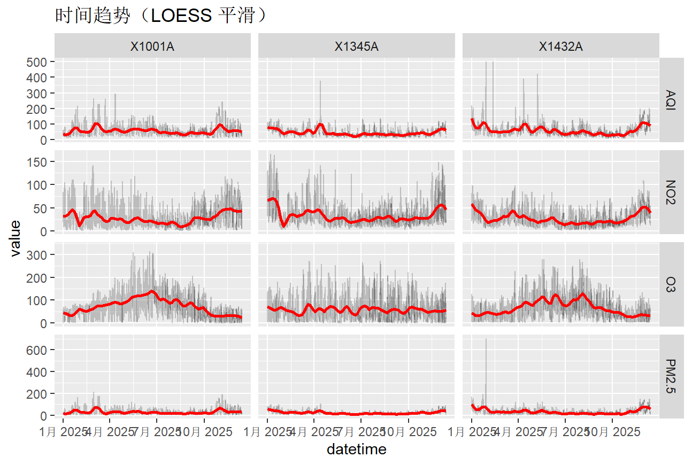
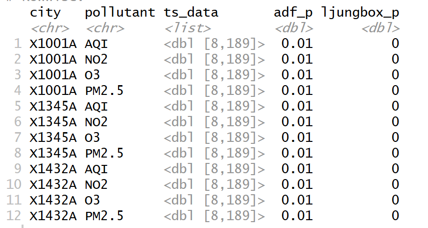
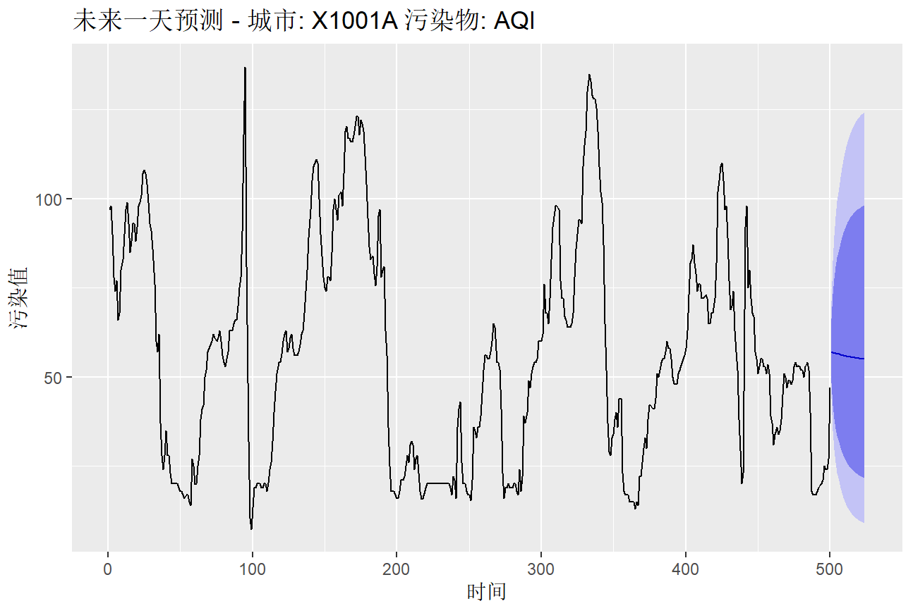
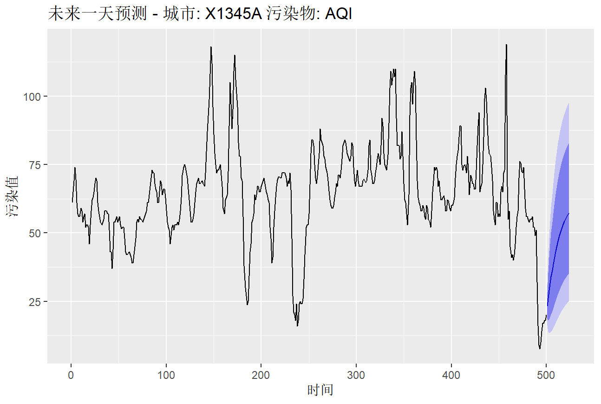

# 时序模型

## 引言

### 项目背景

随着城市化进程的加快和工业化程度的提高，空气污染已成为全球范围内影响公共健康的重要问题。尤其是在快速发展的城市中，空气质量恶化已对居民健康、生活质量以及生态环境造成显著影响。本项目旨在通过对多个城市的污染物数据进行分析，利用时间序列预测方法对未来24小时的空气质量进行预测。通过建立可靠的预测模型，能够为城市的空气质量管理提供科学依据，帮助政府和相关部门提前采取应对措施，减少空气污染对居民健康的潜在威胁。同时，项目还将探讨不同城市之间的空气质量差异，为政策制定和环境保护措施提供支持。

### 项目目标

本项⽬旨在通过对不同城市2025年的空气质量指标数据的深入分析，建立合适的时间序列模型

- **数据分析与可视化**：分析和可视化不同城市在不同时间段的空气质量变化趋势，识别空气污染物浓度的季节性波动和长期趋势。
- **平稳性与随机性分析**：评估和验证时间序列数据的平稳性和随机性，使用合适的检验方法（如ADF检验）进行平稳性分析，为后续建模做好准备。
- **建模与评估**：通过对比和评估不同时间序列模型（如 ARIMA、SARIMA 等），选择最佳模型进行未来24小时空气质量的预测，并对模型进行性能评估。
- **政策建议**：基于模型预测结果，提出针对城市空气质量管理的政策建议，帮助政府和相关部门制定应对措施，减少空气污染对居民健康的影响。
- **模型局限性与改进方向**：识别模型的局限性，探讨改进方向，包括数据的进一步优化、模型参数的调整或其他预测方法的尝试。

## 数据分析与可视化

### 数据获取

为了分析不同城市的空气质量指标随时间变化，本项目首先从网络上收集到2025年全国各地区的空气质量数据，由于数据太多，分布在不同的文件中，我们首先对数据进行初步的筛选，从中选出分析可能会用到的数据。
本项目选取北京（代号：1001A）、上海（代号：1145A）、广州（代号：1345A）、成都（代号：1432A）四个城市作为研究对象类别，北京作为北方超大城市，体现了燃煤与机动车排放叠加的复合型污染特征，其显著的季节性波动为评估北方地区清洁取暖等政策效果提供了理想样本；成都地处西部盆地，受地形条件限制导致大气扩散能力较弱，近年快速城市化进程中的污染加重趋势，可作为研究地理约束与经济发展双重影响下空气质量演变的典型案例；广州作为南方经济中心，机动车尾气排放主导的污染结构使其臭氧问题尤为突出，为对比不同区域治理模式、探索交通源污染控制路径提供了重要参照。选取污染物为PM2.5、O3、NO2以及空气质量指数AQI。

```r
library(dplyr)
library(tidyr)
library(lubridate)

# 设置城市和污染物
cities <- c("X1001A", "X1145A", "X1345A","X1432A")
pollutants <- c("PM2.5", "NO2", "O3", "AQI")

# 保存所有处理后的数据
df_all <- data.frame()

# 循环日期
start_date <- as.Date("2025-01-01")
end_date <- as.Date("2025-12-13")
all_dates <- seq.Date(start_date, end_date, by="day")

# 文件路径
data_folder <- "站点_20250101-20251213/"

files <- list.files(data_folder, pattern = "\\.csv$", full.names = TRUE)

for(file_name in files){
  print(file_name)

  # 读取 CSV
  if(file.exists(file_name)){
    df <- read.csv(file_name, fileEncoding = "UTF-8")

    # 转成长格式
    df_long <- df %>%
      pivot_longer(cols = -c(date, hour, type),
                   names_to = "city",
                   values_to = "value") %>%
      rename(pollutant = type) %>%
      mutate(datetime = as.POSIXct(paste(date, hour), format="%Y%m%d %H")) %>%
      filter(city %in% cities & pollutant %in% pollutants) %>%
      select(datetime, city, pollutant, value)

    # 累加到总表
    df_all <- bind_rows(df_all, df_long)
  } else {
    warning(paste("文件不存在:", file_name))
  }
}


# 保存整年数据
write.csv(df_all, "china_cities_2025_long_format.csv", row.names = FALSE)
```

整理得到的数据最后保存在文件`china_cities_2025_long_format.csv`中。

### 读取数据并做基础检查

数据加载过程包括从CSV文件或数据库中读取历史空气质量数据，并对数据进行初步清洗与预处理。此过程涉及时间格式的转换，确保数据格式与分析需求一致，为后续的时间序列建模提供可靠的数据基础。

```r
# 数据读取和基础检查
# 读取 CSV
df <- read_csv("china_cities_2025_long_format.csv",
               col_types = cols(
                 datetime = col_character(),
                 city = col_character(),
                 pollutant = col_character(),
                 value = col_double()
               ))

# 解析 datetime
df <- df %>%
  mutate(
    # 尝试按完整格式解析
    datetime_parsed = as.POSIXct(datetime,
                                 format = "%Y-%m-%d %H:%M:%S",
                                 tz = "Asia/Shanghai"),
    datetime_parsed = ifelse(is.na(datetime_parsed),
                             paste0(datetime, " 00:00:00"),
                             datetime),
    # 最终转换为 POSIXct
    datetime_parsed = as.POSIXct(datetime_parsed,
                                 format = "%Y-%m-%d %H:%M:%S",
                                 tz = "Asia/Shanghai")
  ) %>%
  select(-datetime) %>%       # 可以删除原来的列
  rename(datetime = datetime_parsed)  # 重命名为 datetime


str(df)
summary(df$value)
```

在进行初步检查后，我发现数据中存在大量缺失值，需要在后续检查中发现具体缺失的是什么类型的数据。


**时间覆盖情况检查**
首先检查是否是某一段时间的缺失，画出时间密度图

```r
# 时间覆盖情况
ggplot(df, aes(x = datetime)) +
  geom_density(
    fill = "steelblue",
    alpha = 0.6
  ) +
  labs(
    title = "时间密度分布",
    x = "Datetime",
    y = "Density"
  ) +
  theme_minimal()
```


时间密度函数分布较为均匀，可以排除是时间段数据缺失的缘故，因此接着检查是否是某个城市的数据缺失或者是某种污染物的数据缺失。
**城市/污染物缺失值检查**
缺失值比例（按城市 × 污染物）
在缺失值可视化中发现，城市1145A在所有污染物上呈现接近 100% 的缺失率，表明该站点在研究期间内数据不可用，因此在后续分析中将予以剔除。

**箱线图判断初步异常值**
首先绘制箱线图，查看异常值情况

```r
# 异常值初步识别（箱线图）
ggplot(df,
       aes(x = pollutant, y = value)) +
  geom_boxplot(outlier.color = "red") +
  facet_wrap(~ city, scales = "free") +
  labs(title = "异常值初步识别（箱线图）")
```

通过箱线图的分析，发现数据中存在一些明显的异常值，这些异常值可能会影响模型的准确性和稳定性。后续将需要对这些异常数据进行处理，包括但不限于去除或替换异常值、进行数据修正或通过合适的方式进行插值，确保数据质量符合建模要求。


### 数据预处理

#### 剔除数据缺失的城市

在初步检查过程中，发现城市1145A的空气质量数据几乎为空，为确保分析结果的准确性和可靠性，将剔除该城市的所有数据。

```r
# 剔除没有数据的城市
city_missing <- df %>%
  group_by(city) %>%
  summarise(na_rate = mean(is.na(value))) %>%
  arrange(desc(na_rate))

city_missing
cities_to_remove <- city_missing %>%
  filter(na_rate > 0.9) %>%
  pull(city)

cities_to_remove
df_clean <- df %>%
  filter(!city %in% cities_to_remove)
```

#### 处理缺失值

采用平滑插补，使用 STL 分解方法插补缺失

```r
#平滑插补，使用 STL 分解方法插补缺失
df_filled <- df %>%
  group_by(city, pollutant) %>%
  arrange(datetime) %>%
  mutate(
    value_filled = na_interpolation(value, option = "spline")  # 样条插值
  ) %>%
  ungroup()
```

#### 处理异常值

在异常值处理过程中，通过计算四分位数和IQR（四分位间距），识别并将超出正常范围的值标记为缺失值（NA）。随后，使用样条插值法对缺失值进行填补，以确保数据的连续性和完整性，为后续建模提供高质量的数据。

```r
# 异常值处理
df_clean <- df_filled %>%
  group_by(city, pollutant) %>%
  mutate(
    value_clean = {
      # 计算 IQR
      q1 <- quantile(value_filled, 0.25)
      q3 <- quantile(value_filled, 0.75)
      iqr <- q3 - q1
      # 异常值处理，返回最终列
      ifelse(value_filled < q1 - 1.5*iqr | value_filled > q3 + 1.5*iqr,
             NA, value_filled)
    }
  ) %>%
  ungroup()
#再对空值进行插补
df_clean_filled <- df_clean %>%
  group_by(city, pollutant) %>%
  arrange(datetime) %>%
  mutate(
    value_filled = na_interpolation(value_clean, option = "spline")  # 样条插值
  ) %>%
  ungroup()
```

### 时间序列形态探索

画出时间序列的平滑趋势图（LOESS），初步判断是否需要差分、是否适合 ARIMA / STL / GAM 等模型。
实现代码如下：

```r
ggplot(df,
       aes(x = datetime, y = value)) +
  geom_line(alpha = 0.2) +
  geom_smooth(method = "loess", span = 0.1, color = "red") +
  facet_grid(pollutant ~ city, scales = "free_y") +
  labs(title = "时间趋势（LOESS 平滑）")
```

得到结果如图所示

初步判断平滑后的趋势线没有显著的变化，数据已经较为平稳，则无需差分。LOESS平滑后的趋势图显示数据平稳（没有明显的长期趋势或季节性波动），考虑在后续建模中使用ARIMA模型。为了更严格判断，需要接着对数据进行平稳性检验与纯随机性检验。

### 数据特性分析

对时间序列数据的平稳性和随机性进行检验，以评估数据是否适合直接建模。

1. 平稳性检验：使用 ADF（Augmented Dickey-Fuller）检验判断时间序列是否平稳。 若结果显示序列不平稳，通过对数变换或差分方法使其平稳。 

2. 纯随机性检验：使用 Ljung-Box 检验判断序列是否具有显著的自相关性。 检验结果表明，该序列存在显著的非随机性，适合建立时间序列模型。
   实现代码如下：
   
   ```r
   results <- df_clean_filled %>%
   group_by(city, pollutant) %>%  # 按城市和污染物分组
   summarise(
     ts_data = list(na.omit(value_filled)),  # 删除缺失值并将每组数据保存为时间序列列表
    .groups = "drop"  # 移除分组
   ) %>%
   rowwise() %>%  # 逐行处理每个时间序列
   mutate(
    adf_p = if(length(ts_data) > 10) adf.test(ts_data)$p.value else NA,  # 对每个时间序列进行ADF检验，若数据长度大于10，则计算p值，否则返回NA
    ljungbox_p = if(length(ts_data) > 20) Box.test(ts_data, lag = 20, type = "Ljung-Box")$p.value else NA  # 对每个时间序列进行Ljung-Box检验，若数据长度大于20，则计算p值，否则返回NA
   )
   results
   ```
   
   #### 结果解读

1.  **ADF（Augmented Dickey-Fuller）检验**：所有时间序列的p值均小于显著性水平（0.05），这表明我们无法拒绝平稳性假设，因此可以推测所有数据序列都具有平稳性。这意味着这些时间序列的均值和方差在时间上是稳定的，不受时间的影响。

2. **Ljung-Box检验**：所有p值接近于0，表明序列存在显著的自相关性，这意味着过去的空气质量数据对未来数据有显著影响。因此，基于这些检验结果，时间序列建模的前提条件已经得到满足，可以进行进一步的模型构建和预测。
   
   
## 数据建模

### 数据建模

   按城市类别和污染物类别对建立时间序列模型，这里我们只选择对空气质量指数AQI进行时间序列建模和数据预测。
   
   ### 时间序列建模

1. **选择数据**：选择要处理的城市和污染物
   
   ```r
   # 选择要处理的城市和污染物
   cities <- unique(df_clean$city)
   pollutant_sel <- "AQI"
   ```

2. **数据提取和处理**：
   
   ```r
# 提取当前城市和 AQI 的数据
ts_data <- df_clean %>%
filter(city == city_sel, pollutant == pollutant_sel) %>%
arrange(datetime) %>%
pull(value_filled)
   
# 转换为时间序列对象
ts_series <- ts(ts_data, frequency = 24)
# 取最后1000小时的数据
ts_subset <- ts_series[(length(ts_series)-999):length(ts_series)]
   ```

3. **选择ARIMA模型**：使用`auto.arima`函数自动选择最优的ARIMA模型。这个过程通过自动选择差分阶数 以及是否包含季节性（seasonal）来构建最适合数据的模型。
   
   ```r
   fit <- auto.arima(
    ts_subset,
    seasonal = TRUE,         # 考虑季节性
    lambda = "auto"          # Box-Cox 自动变换
   )
   ```

4. **预测与误差评估**：在建立好ARIMA模型后，我们使用模型对测试集进行预测，并计算模型的准确度指标。
   
   ```r
   checkresiduals(fit)  # 绘制残差图、ACF/PACF、Ljung-Box 检验
   ```

5. **未来空气质量指数的预测**：使用拟合的ARIMA模型进行未来AQI的预测。预测结果包括未来24小时的空气质量指数。
   
   ```r
   horizon <- 24
   fc <- forecast(fit, h = horizon)
   ```

6. **结果保存**：将预测的结果转换为数据框，并存储为CSV文件，方便后续查看

```r
    # 将预测结果添加到数据框中
    forecast_data <- data.frame(
     city = rep(city_sel, horizon),
     datetime = as.character(time(fc$mean)),
     pollutant = rep(pollutant_sel, horizon),
     forecast_value = as.numeric(fc$mean)
    )
    
    # 合并到所有预测结果中
    forecast_results <- bind_rows(forecast_results, forecast_data)
    
    # 保存结果到 CSV 文件
    write.csv(forecast_results, "forecast_results_AQI.csv", row.names = FALSE)
```

### 模型评估与结果输出

Ljung-Box检验用于检测残差序列的自相关性。它检验模型残差是否为白噪声（即残差之间没有显著的自相关性）。如果p值较大（通常大于0.05），则无法拒绝零假设，意味着残差不具有显著的自相关性，模型拟合较好，残差可以视为白噪声。
从Ljung-Box检验结果来看，这三个ARIMA模型的p值均大于0.05，表明模型残差不具有显著的自相关性，符合白噪声假设。这是一个正面的结果，意味着模型的拟合效果较好，残差符合随机性，没有遗漏的模式或趋势。

### 可视化预测结果
为了更直观地展示预测结果，我们使用`ggplot2` 进行预测数据的可视化。
```r
p <- autoplot(fc) +
ggtitle(paste("未来24小时预测 - 城市:", city_sel, "污染物:", pollutant_sel)) +
xlab("时间") +
ylab("污染值")
```




## 模型解读和建议

基于本项目所建立的ARIMA模型预测结果，我们可以得出以下几个关键结论，并提出针对性的建议：

**1. 模型拟合效果良好**
从Ljung-Box检验的结果来看，所有拟合的ARIMA模型的残差都没有显著的自相关性（p值大于0.05），这表明模型在拟合过程中，已经很好地捕捉了时间序列中的模式，残差表现为白噪声。此结果表明模型的预测效果较为可靠，且没有遗漏的数据趋势或周期性波动。

**2. 预测准确度**
通过对未来24小时的空气质量预测，ARIMA模型展示了较为准确的预测能力。根据残差图、ACF/PACF图和Ljung-Box检验结果，模型能够较好地对空气质量数据进行拟合，预测的未来空气质量指数（AQI）呈现出合理的波动趋势。

**3. 适应不同城市的差异**
模型展示了对不同城市空气质量差异的适应能力。例如，北京作为北方城市，明显的季节性波动得到了有效捕捉；而广州等南方城市的污染模式也能通过模型较为准确地反映出来。每个城市的空气质量波动因其独特的地理、经济和气候条件而有所不同，但都能在模型中得以体现。

**4. 政策建议**

- **空气质量管控**：通过基于ARIMA模型的预测结果，政府可以提前识别未来几小时或一天内空气质量可能出现的高峰时段，并采取相应的应对措施，例如限行、工业减排等，以减少对居民健康的影响。

- **清洁取暖政策**：对于北京等北方城市，季节性波动较大，因此应重点关注冬季取暖期间的污染排放问题。通过实时预测模型，可以为政策制定者提供依据，帮助评估清洁取暖政策的效果。

- **交通源污染控制**：对于广州等南方城市，车辆尾气排放是主要的空气污染源。因此，加强交通源污染治理，通过优化交通流量、推动新能源汽车使用等措施，可以有效改善空气质量。
  **5. 模型可持续性**
  虽然ARIMA模型在本项目中表现良好，但它也存在一定的局限性：

- **长期趋势的捕捉**：ARIMA模型可能不适用于捕捉数据中存在的长期趋势或突发事件（例如突发的污染事故），因此在实际应用中，可能需要结合其他预测方法（如GAM或深度学习模型）来补充其不足。

- **季节性波动的处理**：虽然SARIMA模型已经考虑了季节性因素，但若城市间季节性差异较大（如北方与南方城市），可能需要进一步对季节性进行优化，或尝试更多自适应性强的模型。
  
## 模型不足和优化建议
  
  当前模型仍然存在一定的不足之处，后期仍可以进行改进和完善。
  
  **1. 增加外部变量**：
    当前模型仅考虑了空气污染物浓度数据，但空气质量还受天气、交通、工业排放等多重因素的影响。未来可进一步增强模型，考虑引入更多外部因素（例如气温、湿度、风速等气象因素），以提高模型的综合预测能力。
  
  **2. 季节性和周期性调整**：
    尽管我们采用了SARIMA模型来处理季节性因素，但不同城市的季节性特征差异较大，可能导致模型在某些城市的季节性波动处理不准确。因此，未来可以考虑优化季节性模型，如增加局部季节性调整或采用非线性模型来应对复杂的季节性波动。
  
  **3. 模型验证和监控**：
    通过对比预测结果与实际情况，定期验证模型的准确性，并根据新的数据对模型进行重训练和调整。尤其是空气质量受到政策、天气等因素的影响，需定期调整模型参数以确保长期预测的准确性。